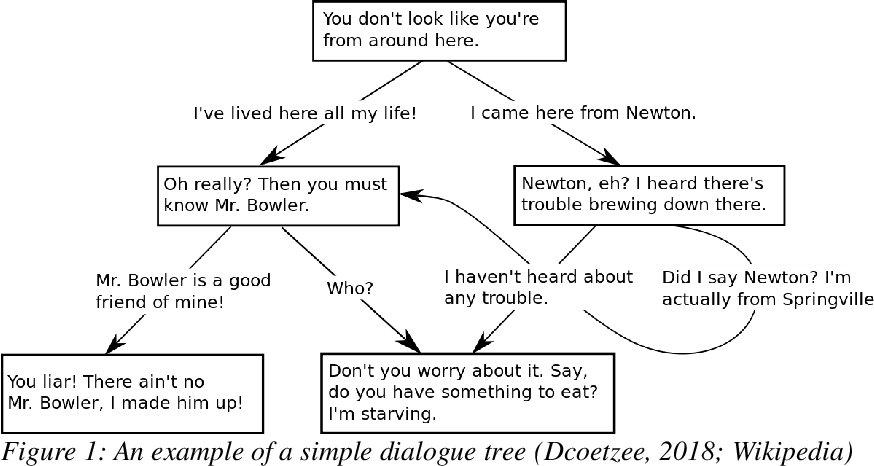

# Assignment: Text adventure - second final
*PLEASE READ THIS **ENTIRE** DOCUMENT FIRST*

* [the assignment](#the-assignment)
* [submitting-your-work](#submitting-your-work)

## The assignment
 

* Create the local project as described [here in GitBook](https://cmd-viscom.gitbook.io/2-2-mmt5/opdrachten/4-cookies-and-storage#eindopdracht).
* Make sure that this website works on your local machine.

## Submitting your work
* Be sure to update only the main branch.
* Your last commit before the deadline will be the version you will submit.
* You do not have to create Pull Requests in this repo, because you will only work in the main branch.
* You can double-check your work by visiting your GitHub Pages URL (be sure to select the main as branch for GitHub Pages).
